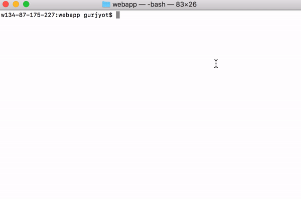

# Stratocumulus

Stratocumulus is a command line interface that spoils developers. Our goal is to provide amazing tools
that increase development speeds by handling service connection and infrastructure for you. In addition,
Stratocumulus allows its developers to quickly initialize new projects with their favorite services in one simple command.

Please see the [official Stratocumulus page](http://alexfattouche.com/Stratocumulus) for information and docs.

